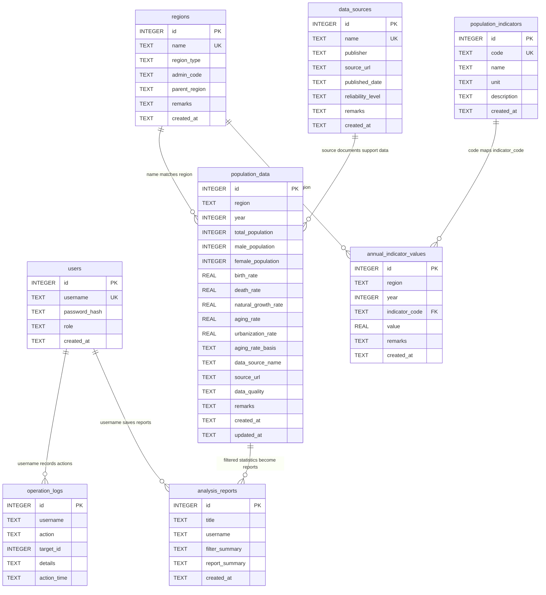
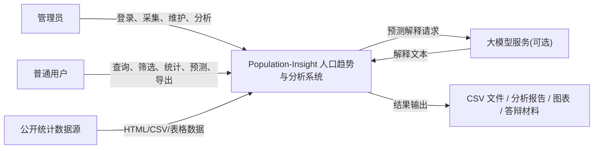
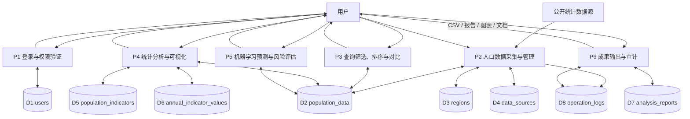
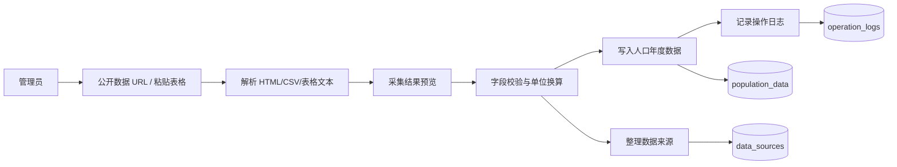
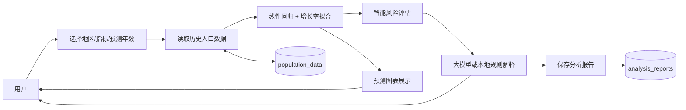

# Population-Insight ER 图与 DFD 图

本文档用于课程设计、数据库实践和答辩材料展示，描述系统 8 张核心数据表之间的关系，以及人口趋势分析系统的数据流。

## ER 图

## DFD 上下文图

## DFD 0 层图

## DFD 1 层：人口数据采集与导入

## DFD 1 层：预测、解释与报告输出

## 关系说明

- `users.username` 与 `operation_logs.username`、`analysis_reports.username` 是逻辑关联，用于追踪用户行为和报告归属。
- `regions.name` 与 `population_data.region`、`annual_indicator_values.region` 是逻辑关联，用于地区档案和年度数据的对应。
- `population_indicators.code` 与 `annual_indicator_values.indicator_code` 是外键关系，用于扩展指标定义和值的关联。
- `data_sources` 用于记录公开统计数据来源，与人口数据保持来源说明层面的业务关联。
